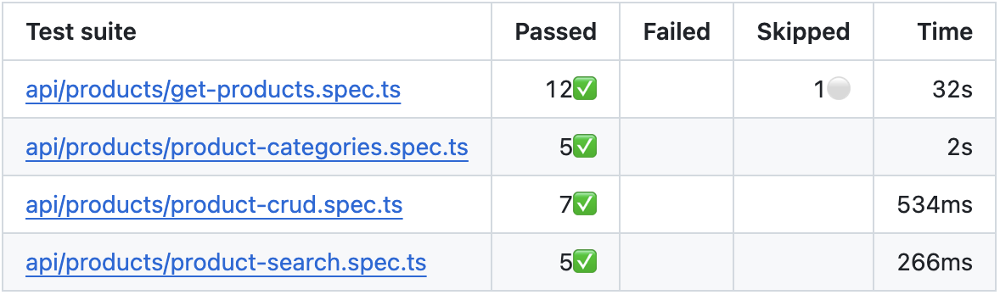

# DummyJSON API Automation Framework

[](https://github.com/schopury/playwright-api-products-suite/actions/workflows/api-pipeline.yml)

A layered API automation framework built with **Playwright + TypeScript** to validate DummyJSON Products endpoints. Designed for reliability, parallel execution, and automated reporting.

Base URL: https://dummyjson.com  
API Reference: https://dummyjson.com/docs/products

## Architecture Model

| Layer     | Responsibility                                                                                                             |
| :-------- | :------------------------------------------------------------------------------------------------------------------------- |
| Transport | Generic HTTP wrapper (`apiRequest<T>`) responsible for request execution, type-safe responses, and resilient JSON parsing. |
| Client    | Typed API abstraction (`ProductsClient`) encapsulating endpoint paths and request construction.                            |
| Fixture   | Dependency injection layer ensuring per-test isolation and parallel-safe state handling.                                   |
| Tests     | Business logic validation, tagging and Zod schema assertions.                                                              |

## Execution Commands

Install dependencies:

```bash
npm install
```

Run the full test suite:

```bash
npm test
```

Run specific test groups:

```bash
npm run test:smoke
npm run test:functional
npm run test:negative
```

Run a specific spec file:

```bash
npx playwright test tests/api/products/get-products.spec.ts
```

Run lint checks:

```bash
npm run lint
```

Test Report
The suite generates a Playwright HTML report for detailed result analysis.
Open the latest report:

```bash
npm run show-report
```

## 📊 CI/CD & Reporting

Tests run automatically on push via GitHub Actions. The pipeline publishes structured test summaries using `dorny/test-reporter` with JUnit output for visibility in pull requests.



## ⚠️ Known API Limitations & Handling

DummyJSON simulates backend behavior. POST/PUT/DELETE operations do not persist changes, so assertions focus on contract validation rather than database state.

Some of the sorting scenarios shows inconsistent ordering due to backend implementation details (e.g., unexpected ordering between single-word "Airpods" and multi-word "AirPods Max" titles). The test is marked with `test.fixme()` and documented to preserve CI stability while transparently tracking upstream inconsistencies.

## Design Decisions & Tradeoffs

The framework follows a layered architecture to enforce clear separation of concerns between HTTP transport, endpoint abstraction, dependency injection, and validation logic. API interactions are encapsulated within dedicated client classes, while Playwright fixtures provide per-test isolation and safe parallel execution. Although it would be possible to construct the suite using only direct requests or only fixtures, combining both improves maintainability and scalability. The tradeoff is slightly increased structural complexity in exchange for cleaner tests and centralized endpoint management.

Schema validation is intentionally performed at the test layer rather than inside the client. This design prevents premature failures in negative scenarios and allows strict contract validation for positive paths while preserving flexibility for malformed or invalid inputs. The tradeoff is minor repetition in validation logic, but it avoids tightly coupling client behavior to a single rigid schema strategy.

Because DummyJSON is a simulated backend with non-persistent state, the suite is structured around contract testing principles. Assertions focus on status codes, headers, and payload structure rather than database side effects. Known upstream inconsistencies (such as sorting issues) are documented using `test.fixme()` to preserve CI stability while maintaining transparency about external defects.

## Reliability & Parallel Execution

- Tests are fully parallel-safe and do not share mutable state.
- Fixtures scope API clients and cleanup per test.
- No test relies on execution order.
- Assertions avoid brittle dataset assumptions (e.g., fixed totals).
- Cleanup logic is executed on a best-effort basis and does not override or mask primary test failures.
